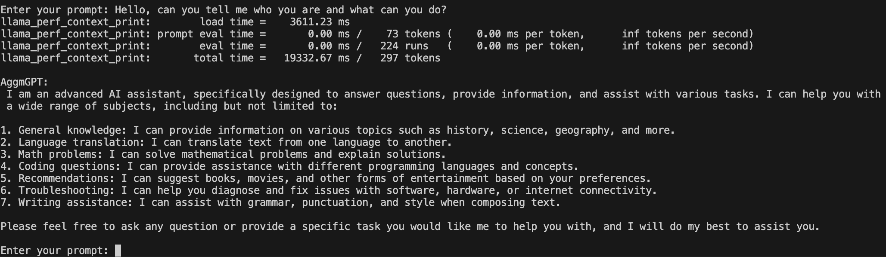

# AggmGPT-2  

Read the [research paper](OfflineLocalPersonalizedArtificalIntelligence.pdf)


AggmGPT-2 is a capable 8B parameters Large language model that is great at following instructions and keeping the context in the conversation.

## Usage

You can easily use this model in Python with the following code:  

```python
from AggmGPT import *
print(AskAggmGPT("What is the capital of France?"))
```

## Model Access  

You can get the .gguf model on Hugging Face:  
🔗 [AggmGPT-2 on Hugging Face](https://huggingface.co/Adolfo-GM/AggmGPT-2)  


